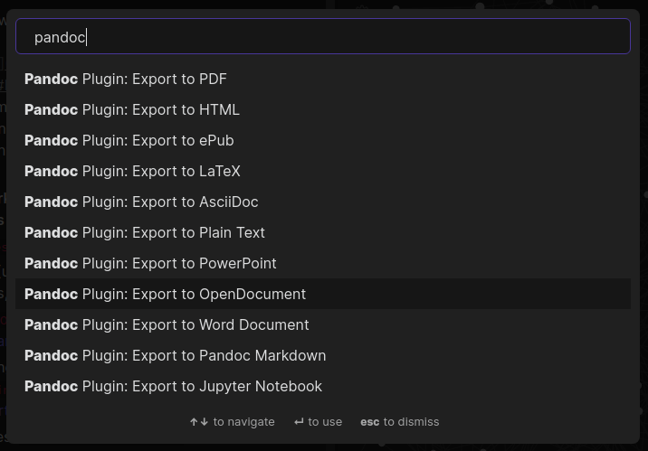

## Obsidian Pandoc Plugin

This is a Pandoc export plugin for Obsidian (https://obsidian.md).

It adds command palette options to export your notes to a variety of formats including Word Documents, PDFs, ePub books, HTML websites, PowerPoints and LaTeX among (many) others. This is all thanks to [Pandoc](https://pandoc.org/).

**Note:** This plugin is still in beta. It **does** support Obsidian's markdown extensions. However, features like the settings interface and good error handling aren't finished yet. There are guaranteed to be bugs (see Known Issues below).

How to install:
1. [Install Pandoc](https://pandoc.org/installing.html) if you have not already
2. Download this repository as a zip file, and unzip it into your `vault/.obsidian/plugins` folder
3. Enable it in the community plugins settings menu

Once the plugin is in better shape, I will make it installable by browsing the community plugins list. For now it's a little tedious.

How it works:
* Press Ctrl+P to show the command palette. (You'll need the core command palette plugin enabled, and you'll need to have a markdown document open.)
* Search "Pandoc"
* Choose your export format
* If all goes well, it will say it was successful
* If you exported a file called `Pandoc.md` as a Word Document, in your file explorer there should now be a `Pandoc.docx` file next to `Pandoc.md`. (I'll add a save file dialog to choose the name/folder soon)

## Known Issues

This is a non-exhaustive list of issues I've found in testing. Most export formats work with most formatting, apart from the exceptions below.

* Reveal.js: complex equations don't work, syntax highlighting doesn't work, footnotes look weird
* LaTeX: foreign images don't work
* PowerPoint: Mermaid.js diagrams don't appear
* Word, OpenDocument: very complex equations sometimes have ? symbols
* Embedded PDFs like `![[file.pdf#page=2]` display as `file.pdf > page=2` when they should be stripped
* Many Pandoc supported output formats aren't yet available (if there are any you'd like to see, just ping me! I'll add most of them soon)
* The settings tab has a *lot* of settings, most of which people won't care about (eg the 3 CSS injection toggle settings should be one at most)
